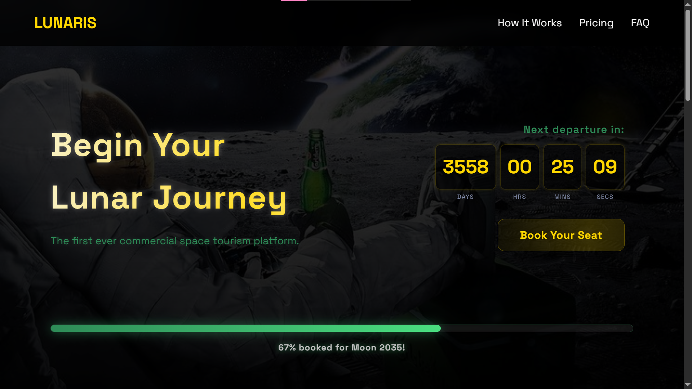

# 🌙 Lunaris — Space Tourism Landing Page

A futuristic, fully responsive landing page for **Lunaris**, a conceptual commercial space tourism company offering interstellar getaways.



## ✨ Features
- Gradient-animated headline
- Countdown to "Moon 2035"
- Seat availability progress bar
- Responsive design
- Pricing cards with hover effects

## 🛠️ Tech Stack
- **HTML5**
- **CSS3** (Flexbox, gradients, keyframe animations, `@media` queries)
- **Vanilla JavaScript** (no frameworks)
- **Google Fonts**: Space Grotesk
- **Font Awesome** (via CDN)

## 🚀 How to Run
1. Clone the repo:
   ```bash
   git clone https://github.com/reishasholihah/lunaris.git
